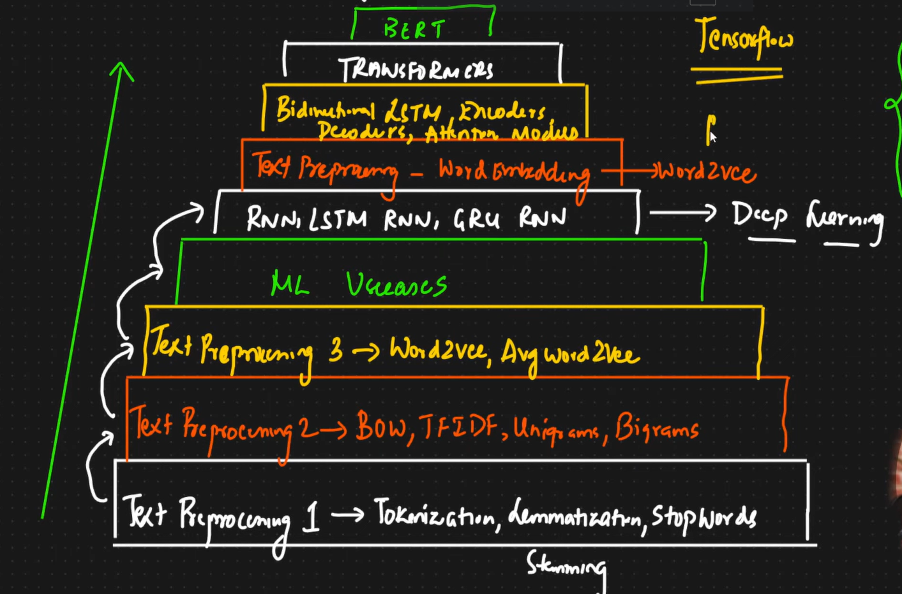
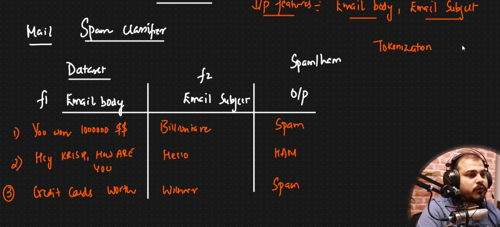
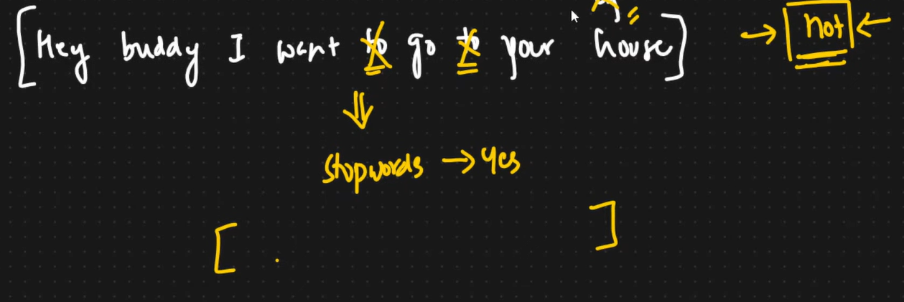
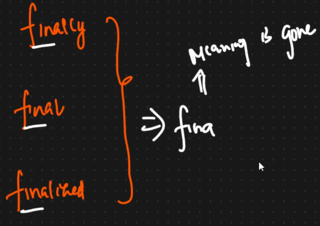
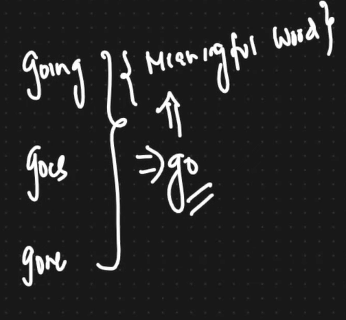
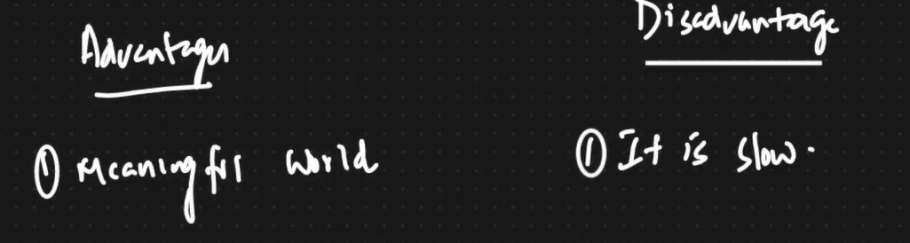

# DAY-1
## What is NLP
#### - Wherever the Data is Text , we need to use NLP.
#### - Texts are converted into Vectors
#### - NLP can be done in both Machine Learning as well as DL
#### - We shd build a model such that it should understand the Text and and based on  that it should give the Output
#### - machine Translation Example: Google Translator
#### - Applications: Spam Classification, Chat Bots

## RoadMap:

## Simple Example:
#### - IN google when we search something, how it recognizes and gives the suitable image for it

## TEXT PREPROCESSING-1
### 1) TOKENIZATION:
#### - consider we are creating a Email Spam Detector, then we need following things:

#### - But we cant make the machine to understand these inmput sentences, therefore the first step is Tokenization
#### - the next step is Stemming, before stemming we can use stop words
#### - After stemming, Lemmatization
### **TOKENIZATION** : Converting Sentences into words

#### - Not all words are important, for example, HE ,She , To are not important, but words like NOT , yes are important, we can remove the unecessary words, these words are called **STOPWORDS**
 

#### - **STEMMING** : We try to find out the base ( base Stem) of a specific Word
#### - For example, HISTORICAL and HISTORY are two different words, but they are both related to the baseword History. 
#### - Performing Stemming on these two words will map to HISTORY
#### - **STEMMING** is the process of reducing the words to their base Stem Word
#### - **DISADVANTAGE** : the Stem Word might not have any meaning, exampple:
#### - **ADVANTAGE** : Its really fast
#### - use case: Spam classifier, Review Classifier

#### - TO overcome this we do Lemmatization
#### - USeful when:

#### **LEMMATIZATION** :
#### - Same as stemming but it has the entire dictionary of words, thus it always Returns Meaningful words.

#### - Use Cases :  text summarization, language translation, chatbots

## TEXT PREPROCESSING-2
#### Converting Words to Vectors