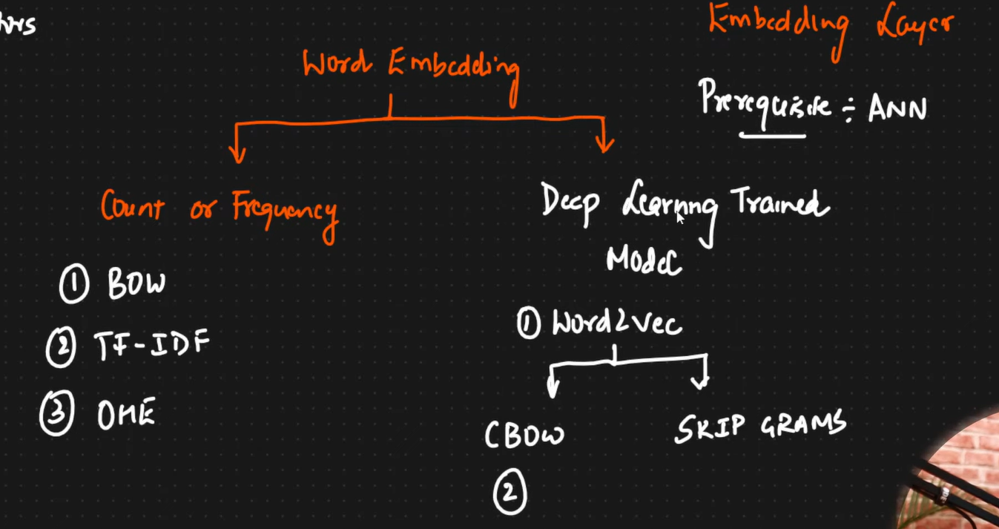
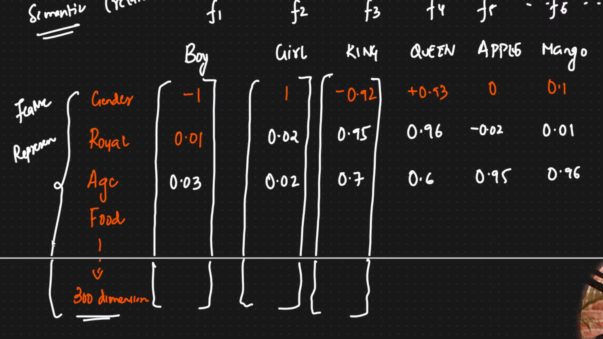
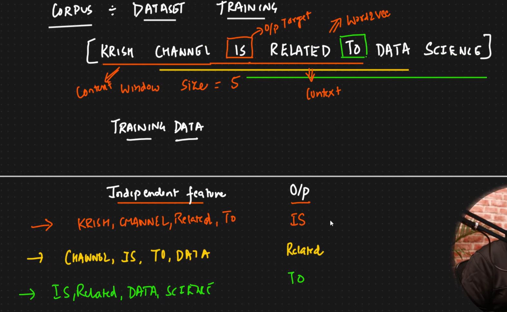
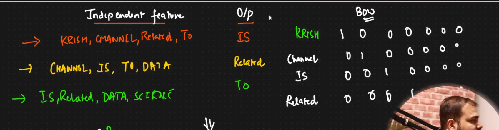

## Word Embeddings:
### A technique tro convert texts into Vectors.
### There are 2 ways to do this. One is using Frequency of words ,the other is using Deep Learning Trained Models 

## Word2Vec:
### - For every words, Vectors are created. THe dimension of the created vectors will be of Limitted Dimensions, within that many dumensions,we will be able to represent a Word.
### - Sparsity is reduced in each vector, we can rarely see any zeros in the Vector Embed
### - Semantic meaning is maintained!
### - For example we are creating vectors for GOOD and HONEST, those two vectors will be similar, which measn , when we subtract both the vectors, their difference will be very less.  
### - Famous example: When we create vector for the word KING,MAN AND WOMEN. then , vector(KING)-vector(man) +vector(WOMEN) teh resultant vector that is similar to vector(QUEEN).

### - Each word is converted into a vector, whose each column represents a FEATURE. If the dimension of a vector is 300, then there are 300 features by which the word is described. The feature maybe  Gender, Royal, Age, Food,.. etc.

### All the values to each Feature in the vector is Generated by the Trained Models.

### - Continuous Bag Of Words (CBOW):
#### -- First Determine and set the WindowSize. Window size is the number of words to be considered at one single time.
#### The middle word in the Window will be the Target Word. other words are context words.COntext words contributes to Independent Feature and the Target Word COntributes to Output Feature.
#### Window Size is a Hyperparameter. Bigger the window size, Better the model we get.
#### The diagram shows feature Representation: E

### - Word2Vec takes all the Independent Features , and based on the Output word, Vector is Generated. 
### - The vectors generated should be such a way that, it should be SIMILAR to the  **Output Feature**

## Architecture of the Word2Vec:
### No. of Nodes in the Hidden layer = Window Size.

### Softmax Activation function is applied on before the resultunt vector.

## SkipGRAM:
#### - In this, the Input column of CBOW will be thje output column, and the Output column of CBOW will be the input column.

### When to use SkipGRAM and CBOW:
#### When we have bigger dataset use SkipGRAM
#### When we have relatively smalled DAtaset use CBOW.