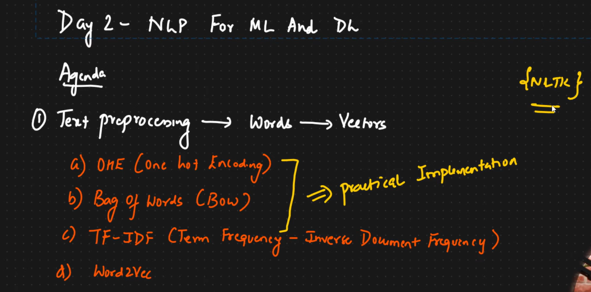
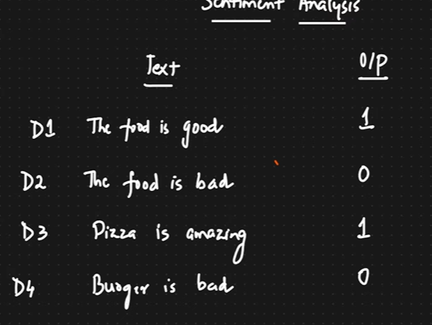
#### Corpus (paragraphs): Set of all Text Datapoints, in the above example, all the texts together is called Corpus
#### Document(generally Sentences): D1 is a Document, D2 is a document, like that

#### Vocabulary: Total number of Unique words in the Dictionary

#### Word:

### Steps in Creating a Model:
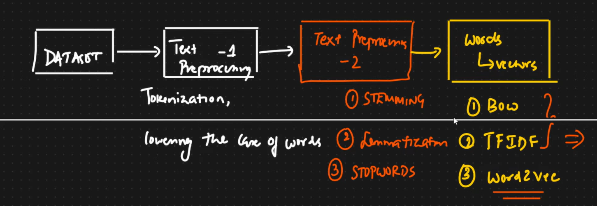

### One Hot Encoding:
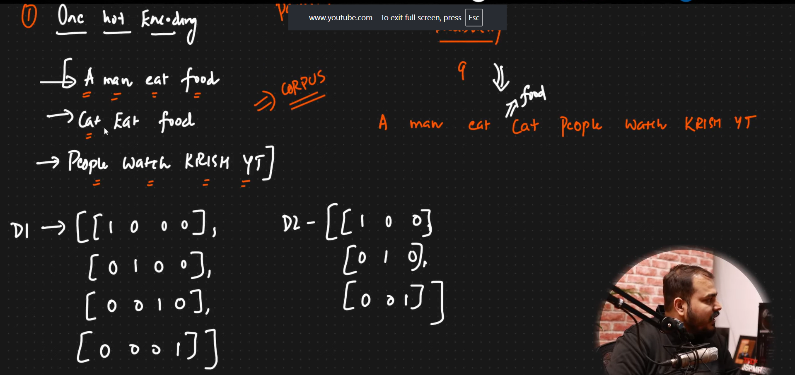
#### The vetor matrix form of D1 & D2 is the One Hot encoding Format
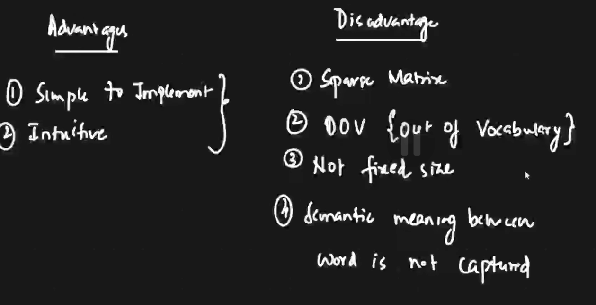
#### OOV : Out of Vocabulary means, the D2 One Hot encoding has 3x3 matrix whereas D1 has 4*x4 matrix, but the Inputs of the model while training should be of same length or dimension, this results in  failure of model training
#### Sparse matrix leads to lots of storage waste and the computation is High

### Bag of Words
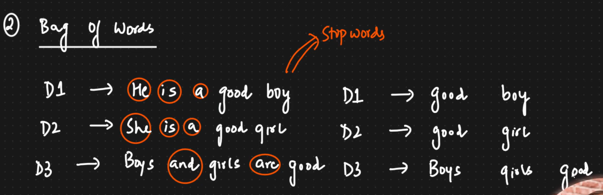
#### before using Stopwords, we will make the case of the words to lowercase
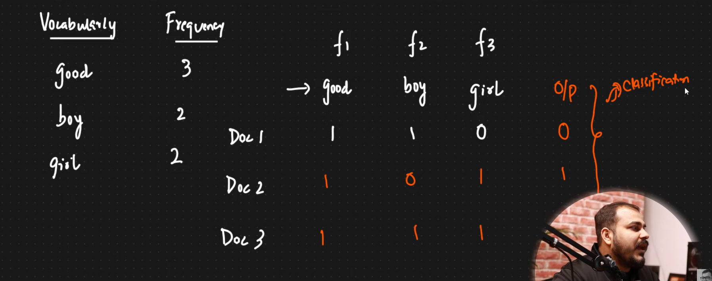
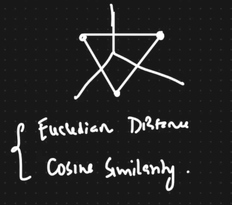

#### when we plot these points in the graph, say 3 d graph, the distance between the points gives the measure of Similarity between the points. 
#### The distance is measured in Either **Euclidean Distance** or **Cosine Similarity**, did distance tells how similar those 2 points are
#### Used in Reccomendation Systems
#### Cosine Similarity : 1 - cos(angle between the two points from origin)
#### If cosine Similarity = 0, then bth the points are close together, if one those two points are dissimilar or far from each other
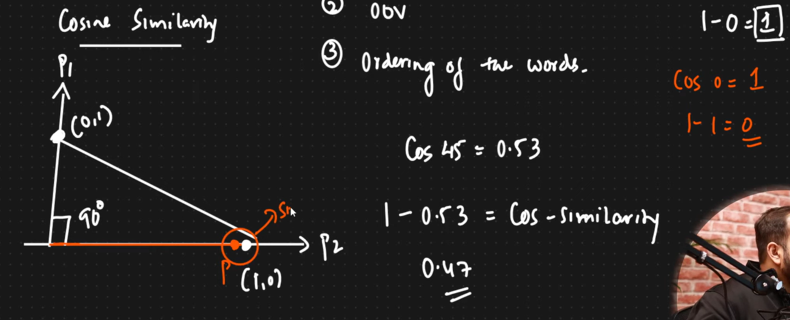
#### This is used in Reccomendation System, for example, if a person watches IronMan movie, he will be suggested with Avengeras movie, as in the graph , they will be placed close together.
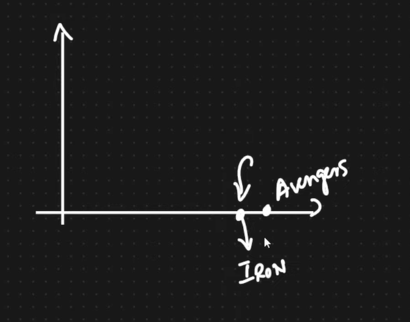
#### but this wont be able to catch the ordering of the word in BOW, in order to do this we use N-grams
#### lets consider Bi-grams:

#### IN Bi-grams we combine Two Features and make into one single feature, good boy is a feature, good girl is another feature
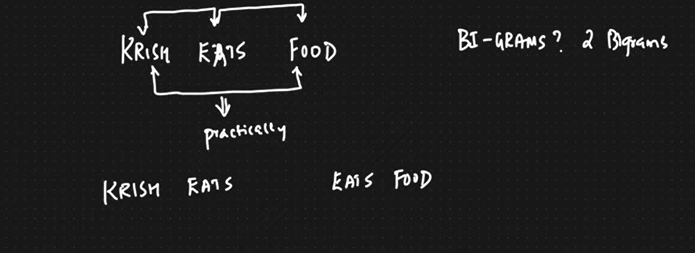
#### In this there can be only 2 Bi grams, Krish Food Bi gram is not Valid
### TriGRams:

## Drawback fo using BOW:
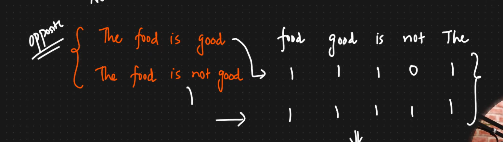
#### When the cosine Similarityb is calculated betwen the two opposite sentences, they turns out to be similar, thus BOW does not give the Semantic meaning of the sentence. this is where TF_IDF is used
#### in BOW all the words are given same imporrance, tha ti severy word is given value 1 if they are present, for example, the importance of the word good is significant than the word boy, but still both are given the same 1, this is why we use Term Frequency - Inverse document Frequency

## TF-IDF: Term Frequency - Inverse Document Frequency
#### Whichever words are rarely occurs in the sentences are given **more weightage**.
#### Rare words are identified by Term Frequency.
#### Common words are captured by Inverse Document Frequency. 
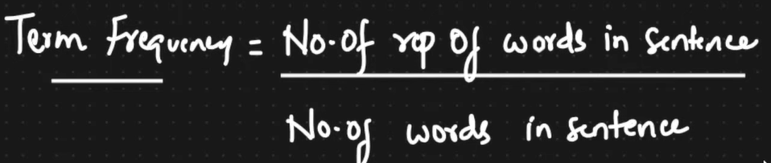
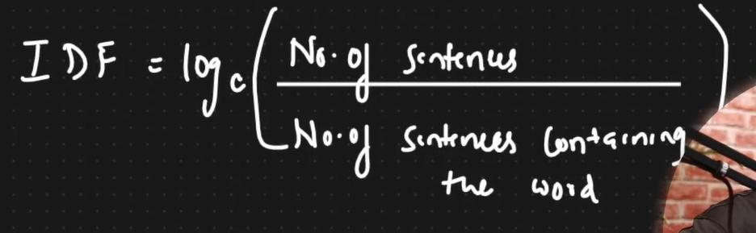
### TF-IDF is calculated by multiplying both the formulas
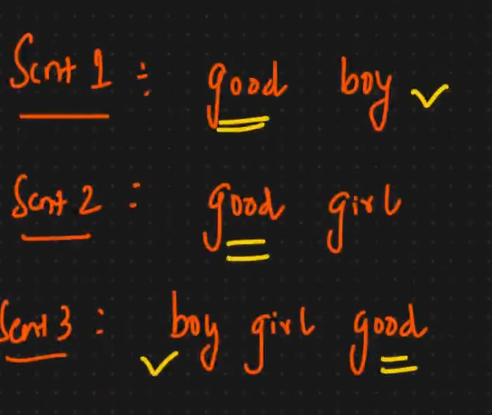
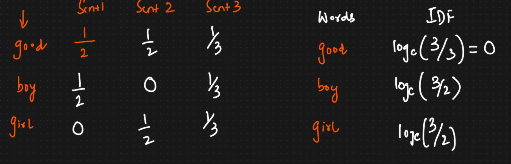
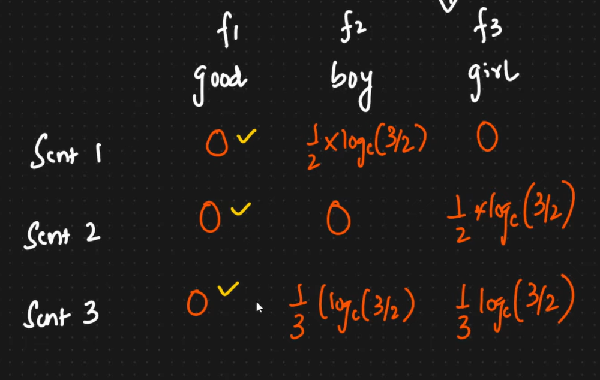