## Interview Questions
1) What is difference betweenm Train, Test and validation Datasets?
 - TRAINING ds, is used to TRAIN the Model
 - TEST dataset is the data set which is not shown to the model whitle training. If it's shown its causes Data Leakage
 - TRAINING ds is split into VALIDATION ds and TRAINING ds , this VALIDATION ds is used for HyperParameter tuning of the model.
 - For Hyper ParAameter tuning , we use tehe Concept of CROSS VALIDATION.(EXample: GridSearchCV, RandomizedSearchCV)
2) Why people use RandomForest mostly than Decision Trees?
 - To avoid OverFittiing
 - Decision Tree usually has Low Bias and High Variance (Overfitting)
 - In order to reduce the High variance to Low Variance and keep low bias as low bias, we use Random Forest

 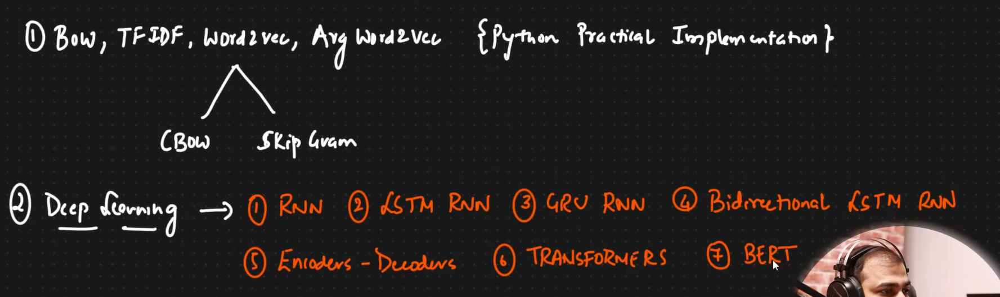
 # Recurrent Neural network
 - In chatbots, the chatbot need to understand each and every word, based on the **sequence** of the words. here the **sequence** of the words is very impportant!
 - Same with language translations, Sequence of the words is very important to understand the Context of the sentence
 - **Text Generation** : We type a sentence, it understand the sentence and suggests us what to write next sequence of words or the whole sentence Gramatically (autocomplete, autoSuggestion)
 - These cant be achieved by machine learniNG Techniques, we should use Deep Learning Techniques
 - This includes **RNN, LSTM RNN , TRANSFORMERS, BERT**
 - RNN is also used to work with TIME SERIES data.

 ### <u>BAsic Architecture of Recurrent Neural Networks:</u>
 - Lets consider this single Neuron in RNN:
 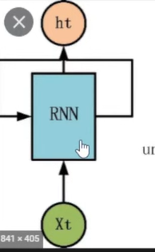
 - Whenever we get an output to an input from a node, the output is sent back to the neuron
 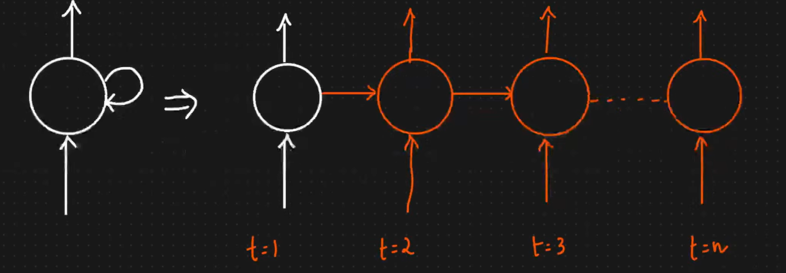
- Whatever output a neuron gets, it passes to the same neuron in the next timestamp

### Understanding RNN through Sentiment analysis:

### Types of RNN:
1) One to One RNN:
- In this RNN we get only One output for One input.
- Use case: Image Classification  
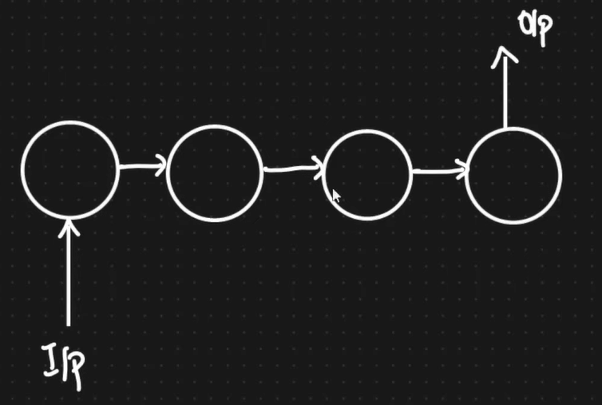
2) One to Many RNN:
- Many outputs for one single input
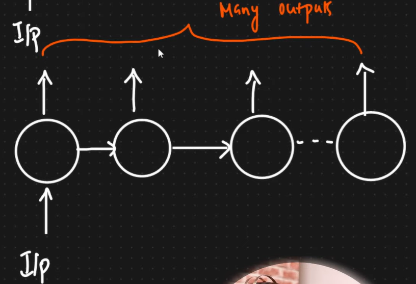
- We can get output from each layer with respect to time stamp
- Use case: Music Generation, Text Generation, Google Search Suggestion, movie reccomendation

3) Many to One
- Continuous Multiple INputs are given, to obtain Single Output
- use Case: Sentiment analysis, Predict NExt Day Sales
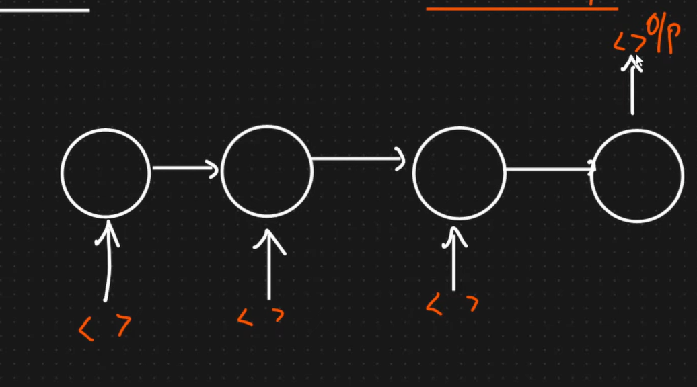

4) Many to Many:
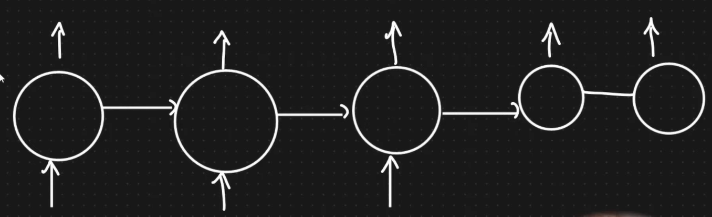
- Use case: Language Translation, Question Answering, Chat Bots

### Forward Propagation in RNN:
##### - lets understand this with Sentiment Analysis (Many to One RNN):
- NOTE: whenever we pass a word into the Deep Network, we pass it as Vectors
- Problem Statment: 
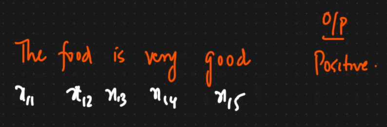
##### Stage 1:
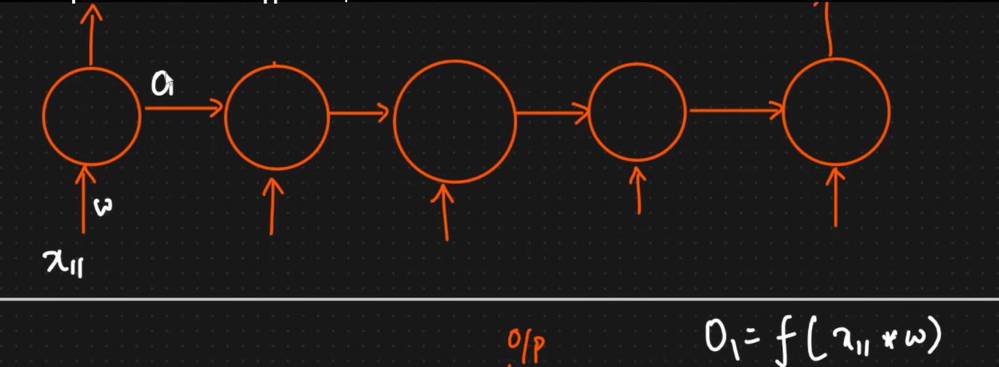
##### Stage 2:
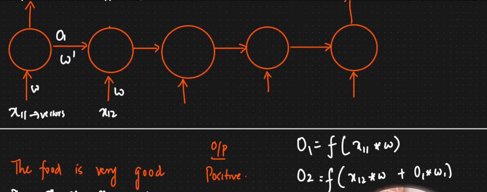
##### Similarly:
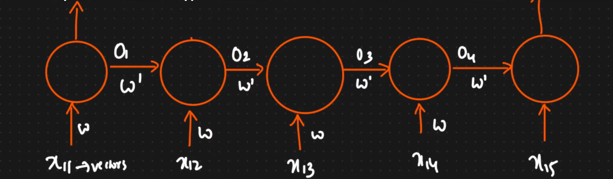
- Since it is  MultiClass Classification Problem we use SOFTMAX as the activation Function, if the Classification problem is Binary, we should use SIGMOID
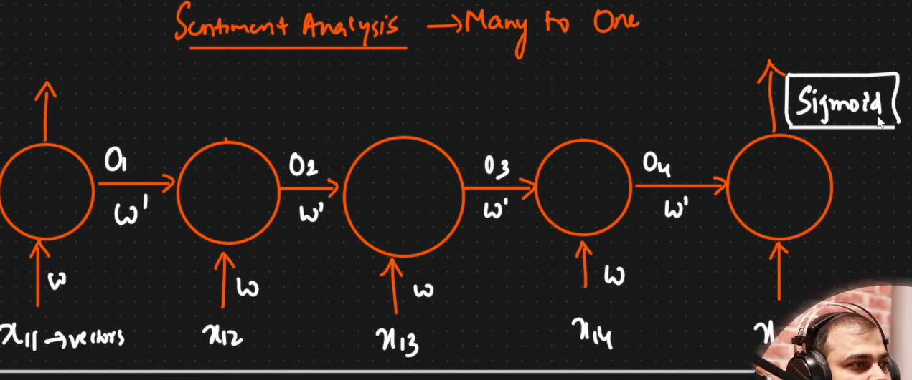
- The output we get form this RNN is denoted as y_hat
- We already have the original y value (the targer value), with y_hat and y we calculate the Loss function, 
- After finding loss, all  weights are updated (both w' and w)
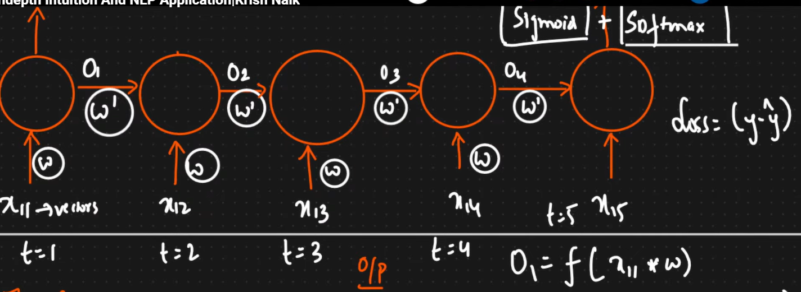