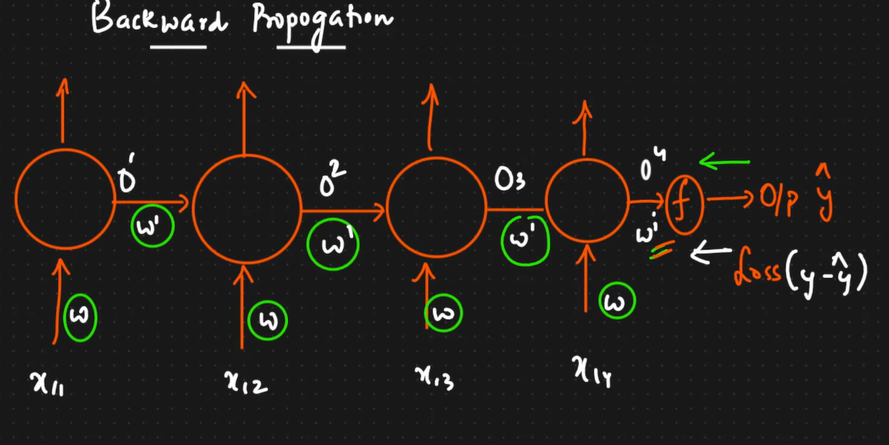
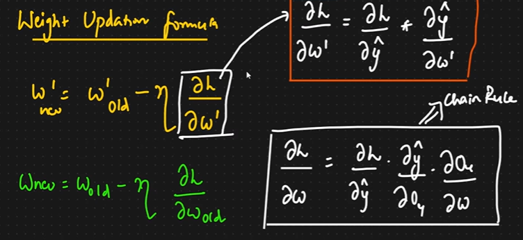
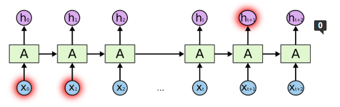
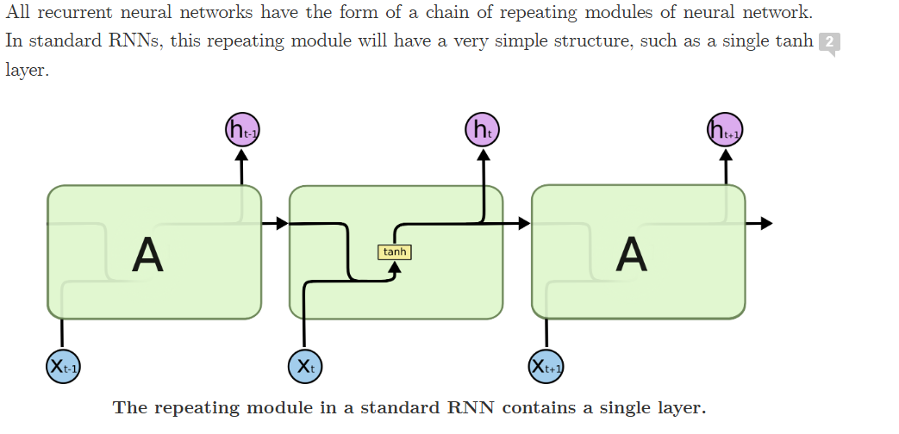

 # Recurrent Neural network
 - In chatbots, the chatbot need to understand each and every word, based on the **sequence** of the words. here the **sequence** of the words is very impportant!
 - Same with language translations, Sequence of the words is very important to understand the Context of the sentence
 - **Text Generation** : We type a sentence, it understand the sentence and suggests us what to write next sequence of words or the whole sentence Gramatically (autocomplete, autoSuggestion)
 - These cant be achieved by machine learniNG Techniques, we should use Deep Learning Techniques
 - This includes **RNN, LSTM RNN , TRANSFORMERS, BERT**
 - RNN is also used to work with TIME SERIES data.

 ### <u>BAsic Architecture of Recurrent Neural Networks:</u>
 - Lets consider this single Neuron in RNN:
 
 - Whenever we get an output to an input from a node, the output is sent back to the neuron
 
- Whatever output a neuron gets, it passes to the same neuron in the next timestamp

### Understanding RNN through Sentiment analysis:

### Types of RNN:
1) One to One RNN:
- In this RNN we get only One output for One input.
- Use case: Image Classification <br>

2) One to Many RNN:
- Many outputs for one single input

- We can get output from each layer with respect to time stamp
- Use case: Music Generation, Text Generation, Google Search Suggestion, movie reccomendation

3) Many to One
- Continuous Multiple INputs are given, to obtain Single Output
- use Case: Sentiment analysis, Predict NExt Day Sales


4) Many to Many:

- Use case: Language Translation, Question Answering, Chat Bots

### Forward Propagation in RNN:
##### - lets understand this with Sentiment Analysis (Many to One RNN):
- NOTE: whenever we pass a word into the Deep Network, we pass it as Vectors
- Problem Statment:<br>

##### Stage 1:

##### Stage 2:

##### Similarly:

- Since it is  MultiClass Classification Problem we use SOFTMAX as the activation Function, if the Classification problem is Binary, we should use SIGMOID

- The output we get form this RNN is denoted as y_hat
- We already have the original y value (the targer value), with y_hat and y we calculate the Loss function, 
- After finding loss, all  weights are updated (both w' and w)


### Back Propagation  in RNN:




- **Early Stopping** : Done when the loss becomes almost stagnant, this marks the end of the model Training.
- If the RNN is veryy long, then we may face Vanishing Gradient problem. 
- This is becos, mostly we are gonna use Sigmoid Function as then Activation Function, we know it ranges from 0 to 1 and its Derivative ranges from 0 to .25, as the model goes deeper and deeper, the loss gradient may tend to zero, and teh weight updation will become negligible, so alll the time there will be teh same Weight.
- To tackle this, LSTM RNN's were introduced! ( Long Short Term Memory Recurrent Neural Network).


## Notes from <a href="https://colah.github.io/posts/2015-08-Understanding-LSTMs/">Colah 2015-08-Understannding LSTMs</a>
- A recurrent neural network can be thought of as multiple copies of the same network, each passing a message to a successor.


#### Problem in RNN (Long Term Dependencies):
- One of the appeals of RNNs is the idea that they might be able to connect previous information to the present task.
- Sometimes, we only need to look at recent information to perform the present task
- there are also cases where we need more context.
- Consider trying to predict the last word in the text “I grew up in France… I speak fluent French.” Recent information suggests that the next word is probably the name of a language, but if we want to narrow down which language, we need the context of France, from further back.
- ```As that gap grows, RNNs become unable to learn to connect the information.```

- In theory, RNNs are absolutely capable of handling such “long-term dependencies.” A human could carefully pick parameters for them to solve toy problems of this form. Sadly, in practice, RNNs don’t seem to be able to learn them.
- This means if there is a very deep RNN, and the last word needs context of the First Word to get the meaning, RNN fails here.
- This problem is Solved by LSTM RNN's

- Consider trying to predict the last word in the text “I grew up in France… I speak fluent French.” Recent information suggests that the next word is probably the name of a language, but if we want to narrow down which language, we need the context of France, from further back.
