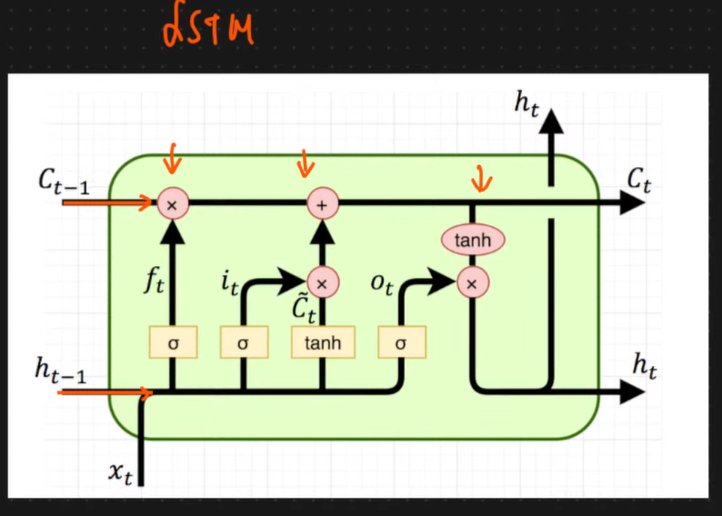
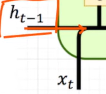
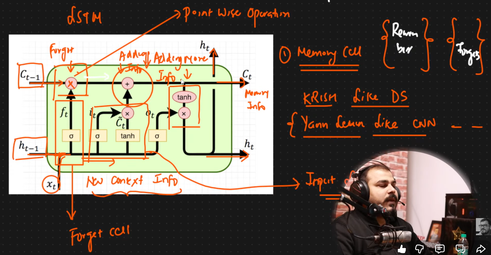

# Long Short Term Memory Recurrent Neural Network:
- This Neural network is able to remember the Context of the word that are being created and context of the word that are being available in the sentences.
- Four Main Sections in LSTM:
- 1) Memory Cell
- 2) Forget Cell
- 3) Input Cell<br>
- ### <u>Architecture of a Neuron in LSTM:</u><br>

- c_t-1 is the Output of the Previous layer
- h_t-1 is the Output of the Previous Cell
- the ```x``` implies, Poinwise Operation multiplication
- if there is ```+``` it implies Pointwise Addition
- The pink circular things are called Memory Cells
- Memory Cells means, they need to remember some of the things and forget some of the things
- The point wise Operations helps to determine, how many things needed to me REMEMBERED and how many things needed to be forgetten
- In the multiplication memory cell, two things can happen: Learning/adding new info or Forgetting exisiting info
- In the adition memory cell, only Learning/addition of Information happens, forgetting info doesnt happen.(Adding more Information)
- The type of info added is ```New Context Info```
- When two lines join together tis called ```Concatenation```, example:

- ```New Context Information``` is acquired from concatenation of h_t-1 and x_t
- the tanh function is used for Normalization
- ```C_t = Memory Information```


