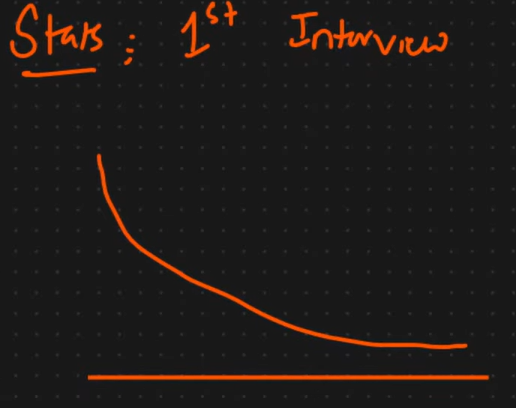
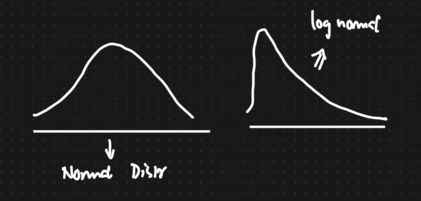
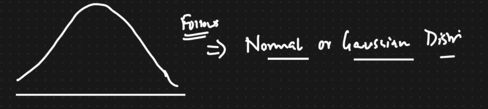
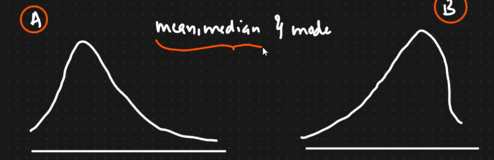

## Interview Questions
1) What is difference betweenm Train, Test and validation Datasets?
 - TRAINING ds, is used to TRAIN the Model
 - TEST dataset is the data set which is not shown to the model whitle training. If it's shown its causes Data Leakage
 - TRAINING ds is split into VALIDATION ds and TRAINING ds , this VALIDATION ds is used for HyperParameter tuning of the model.
 - For Hyper ParAameter tuning , we use tehe Concept of CROSS VALIDATION.(EXample: GridSearchCV, RandomizedSearchCV)
2) Why people use RandomForest mostly than Decision Trees?
 - To avoid OverFittiing
 - Decision Tree usually has Low Bias and High Variance (Overfitting)
 - In order to reduce the High variance to Low Variance and keep low bias as low bias, we use Random Forest
3) What is this type of Distribution of Data Called as: 

 - Answer: Parito Distribution
F.Y.I:

4) How can we convert a Parito Distribution into NOrmal Distribution?(what is the Technique)
 - BoxCox Transform
5) What technique can be applied to know whether a distribution is Normal Distribution or Gaussian Distribution?

 - answer: Q-Q Plots
6) What is Standard Normal Distribution?

7) What is the relationship between Mean, Median and Mode in A and B:

8) What is Difference between fit_transform adn transform?

9) When do we use fit_predict ?

10) What is Difference between Normalization and Standardization?

11) Why LSTM RNN's instead of RNN's ?
- RNN has Vanishing Gradient Problem or Dead neuron Problem

